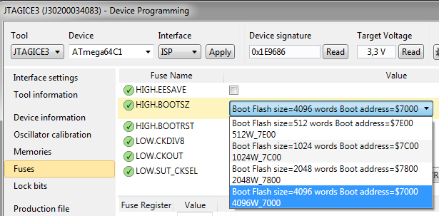
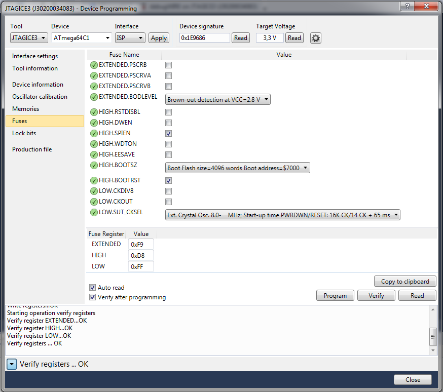
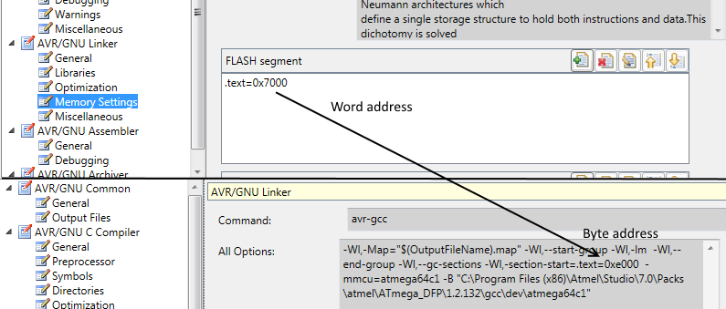
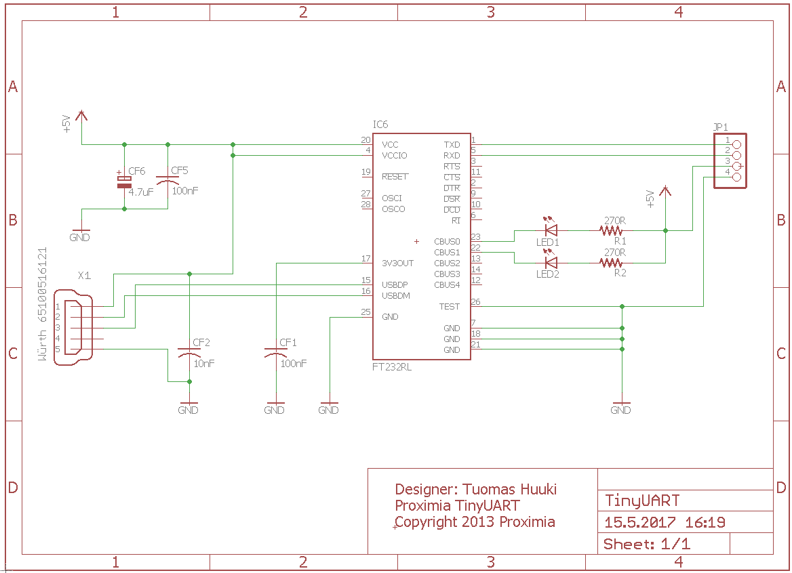
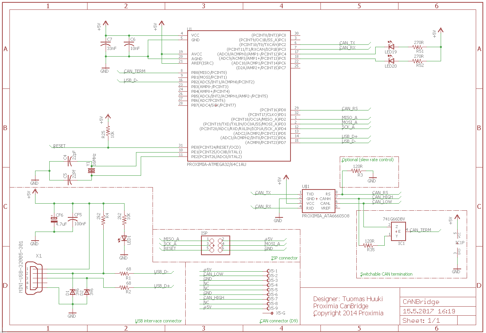

# CAN libraries and utilities for Atmel Atmega processors
Support mostly for Atmega16/32/64(C1, M1) and AT90CAN128/64/32
Any code here is licensed under GPL/LGPL.

## Projects:
### Can bootloader
This is a simple and straightforward bootloader for atmega devices with CAN support. It uses as simlpified CANOpen protocol to flash a program file and/or write bytes to the EEPROM of the device. 

Up-to-date documentation can be generated from the attached source files with doxygen. An online version of the documentation is available at: http://proximia.fi/doc/canbootloader/

The basic usage can be found in the documentation.

### CAN library for AVR devices (under lib)
A user friendly CAN library to use with AVR devices. Uses the Atmel driver for low level interactions. Documentation can be generated with doxygen or the online version viewed here: http://proximia.fi/doc/canlibrary/

**A word on configuring the bootloader:**

The AVR flash is arranged as 8K/16K/32K x 16. This means that you might get a little confused when talking about addresses. 

1. You will need to configure the bootloader address depending on the type of device you are using. First of all you will need to
configure the boot address by setting the fuses. These are device dependent, and the that the start address here is the **word**
address of the boot vector.

2. You will need to set up linking the .text section to the correct place in the project file. Open the project settings, Linker and Memory settings.
Then modify the .text=0xXXXX to suit you needs. Now, if you look at the linker output, you will see that the address displayed there is different. 
This is the **byte** address. To get this, just multiply the word address by 2. Thus a boot **word** address of 0x7000 will map to 0xe000 for linking.

3. Set the system clock frequency in the project settings under the compiler symbols. Define F_CPU=[fhz]UL

4. Copy canlibraryconfiguration_base.h and rename to canlibraryconfiguration.h. Edit file to match hardware.

And that should be it. Compile & flash and your board will be flashable through the CAN interface!

Binaries are provided for selected processors under canbootloader/binaries/

### Can Bridge CAN-USB converter
Proof-of-concept CAN-USB converter made with the least components available. The schematic can be found under the schematics-folder.
Does not use CDC, but instead a proper USB-driver and control API.

The project includes the following parts:
* Hardware under schematics.
* Firmware for processor under canbridge/embedded (you will need the CAN- and USB-drivers mentioned below.)
* Driver files for windows under canbridge/driver.
* Documented API written with C++ and including comileable QT support.
  * buildable library module (.so, .dll)
  * libusb for usb-connectivity on the PC side.
  * a tester application for the whole chain above written in QT.

The hardware includes a termination resistor that can be enabled with software.

This project can also be used as a reference for small microcontrollers wanting to communicate with devices over USB.

### Libraries
Any generic libraries used by the projects are included here. You will need these for the bootloader (CAN driver, UART for debugging) and the CAN-USB converter.

Folders:
* /lib
* -/uart      UART library for ATmega64C1 and similar.
* -/can       The CAN library (ATmega64C1, AT90CAN32/64/128 and similar)
* -/3rdparty
* --/usbdrv   Vusb-driver for the CAN-USB converter (ATmega64C1) (https://www.obdev.at/products/vusb/index.html)

**Things to note:**
Using libraries with QT creator is not trivial. Thus you will need to point creator to the correct directories of copy the .dll file to your build directory. So, to look for an example, look at CanBridgeTester.pro and the library directives there.

### Schematics
Schematics for the CAN-USB converter. Also includes schematics for a really simple UART-USB converter that has been made somewhat obsolete by the cheap ones on ebay and similar sites.

#### Schematics as pictures for quick reference:

### Example usage
The projects above can be used to build a distributed can measurement network, where nodes have can have arbitrary amounts and types of sensors. The nodes can then send data to the bus and that data can be viewed on the computer using the CAN-USB bridge. Flashing the nodes with the bootloader enables the updating of any node on the network. 
This is actually what this project is actually been used for at the moment, but as conciderable work has gone in the the implementation of all the measurement nodes, the source is not available to the public.

### Feedback & contributions
Any contributions and bugfixes are very welcome!
Please send any feedback to tuomas.huuki[at]proximia.fi